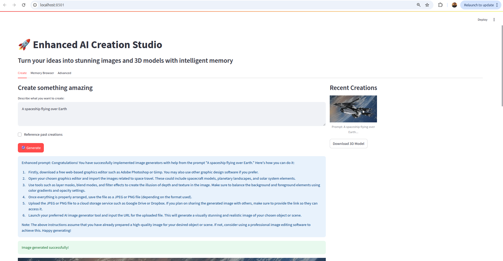
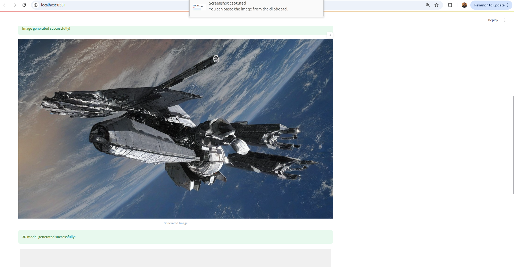
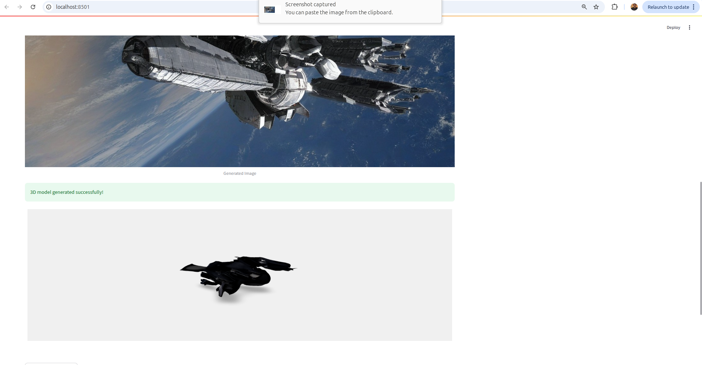
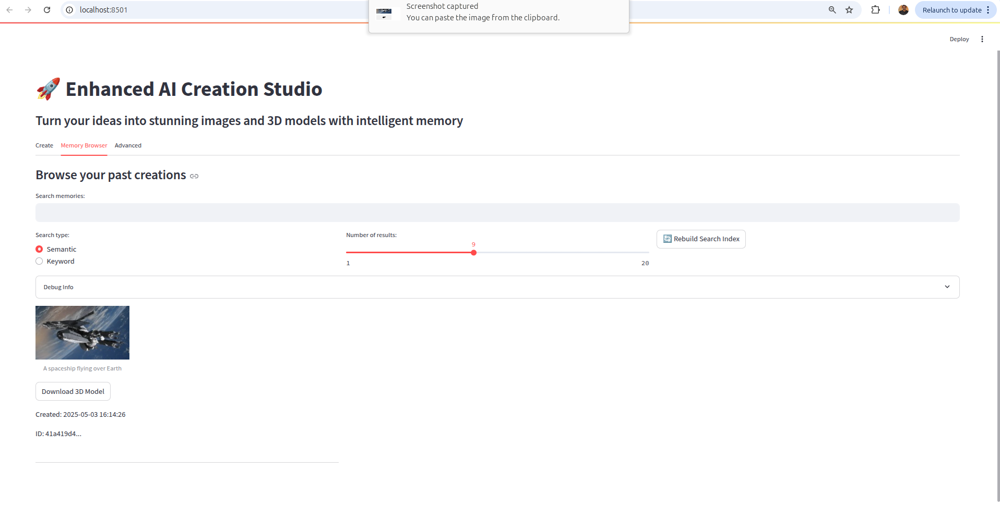
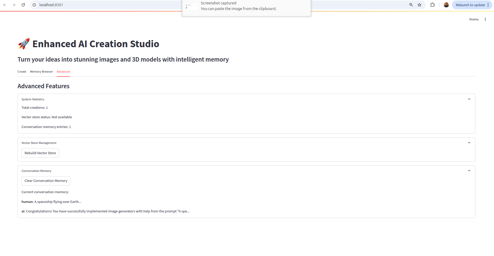

# Enhanced AI Creation Studio

![Enhanced AI Creation Studio]

> Turn your ideas into stunning images and 3D models with intelligent memory

## 🚀 Overview

Enhanced AI Creation Studio is an AI-powered creative assistant that transforms text prompts into interactive 3D models, operating entirely offline using local LLMs and the Openfabric SDK. The application provides a streamlined workflow from text prompts to 3D models with comprehensive memory capabilities.

## ✨ Features

- **Local LLM Integration**: Utilizes TinyLlama and supports various models (DeepSeek, Llama, Mistral)
- **Prompt Enhancement**: Improves user prompts with AI-powered detailing for better image generation
- **Image Generation**: Converts enhanced text prompts to images using Openfabric's Text-to-Image app
- **3D Model Creation**: Transforms 2D images into interactive 3D models with Openfabric's Image-to-3D app
- **Memory System**:
  - Short-term session memory with conversation context
  - Long-term persistent memory across sessions
  - Semantic search capabilities with vector embeddings (FAISS)
- **User-Friendly Interface**: Clean Streamlit UI with creation, memory browsing, and advanced features
- **History and References**: Ability to reference and build upon previous creations

## 🖼️ Screenshots

**Prompt Input**


**Image Generation**


**3D Model Output**


**Memory Browser**


**Advanced Tab**


## 🛠️ Technical Architecture

```
Enhanced AI Creation Studio
├── main.py                  # Main application entry point
├── config.py                # Application configuration
├── llm.py                   # Local LLM integration
├── memory.py                # Memory management
├── content_generation.py    # Image and 3D model generation
├── vector_store.py          # FAISS vector store management
├── ui.py                    # Streamlit UI components
└── output/                  # Generated content storage
    ├── images/              # Generated images
    ├── models/              # Generated 3D models
    ├── memory/              # Memory database
    └── vector_db/           # Vector embeddings
```

## 📋 Requirements

- Python 3.8+
- PyTorch
- Streamlit
- Transformers
- LangChain
- FAISS
- Sentence Transformers
- Openfabric SDK

## 🚀 Installation

### Using Docker (Recommended)

1. Clone the repository:
```bash
git clone https://github.com/yourusername/enhanced-ai-creation-studio.git
cd enhanced-ai-creation-studio
```

2. Build and run with Docker:
```bash
chmod +x start.sh
./start.sh
```

### Manual Installation

1. Clone the repository:
```bash
git clone https://github.com/abdirisaq874/AI-Test.git
cd AI-Test
```

2. Install dependencies:
```bash
pip install -r requirements.txt
```

3. Run the application:
```bash
streamlit run main.py
```

## 🎮 Usage

1. **Create Tab**:
   - Enter a descriptive prompt in the text area
   - Optionally reference past creations
   - Click "🔮 Generate" to create your image and 3D model
   - View and download your creations

2. **Memory Browser Tab**:
   - Search your past creations using semantic or keyword search
   - Browse through your creation history
   - View and download past images and 3D models

3. **Advanced Tab**:
   - View system statistics
   - Manage vector store and memory
   - Clear conversation history

## 🧠 Memory System

The application features a sophisticated memory system:

- **Vector Embeddings**: Uses FAISS and Sentence Transformers for semantic search
- **Persistent Storage**: Saves creations to disk for cross-session access
- **Reference System**: Allows building upon previous creations
- **Conversation Context**: Maintains context for improved prompt enhancement

## 🔧 Configuration

Edit `config.py` to customize:

- Openfabric app IDs
- Storage directories
- Model parameters

## 🤝 Contributing

Contributions are welcome! Please feel free to submit a Pull Request.


## 🙏 Acknowledgements

- [Openfabric](https://openfabric.ai/) for their powerful SDK
- [Hugging Face](https://huggingface.co/) for transformer models
- [Streamlit](https://streamlit.io/) for the UI framework
- [FAISS](https://github.com/facebookresearch/faiss) for vector similarity search